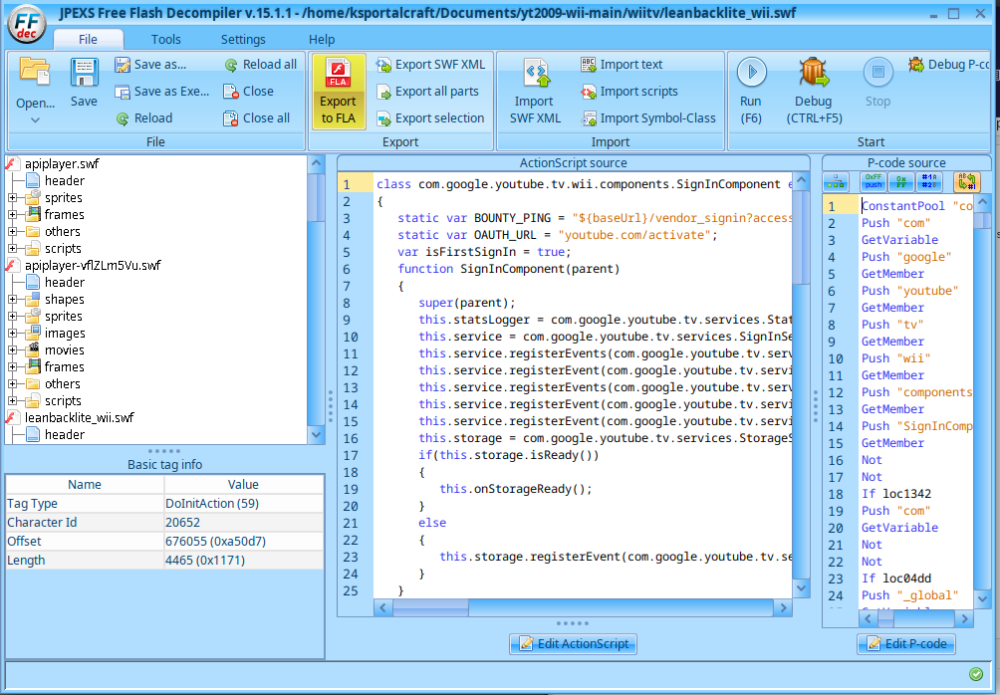

# yt2009wii - aka NexTube

a fairly accurate 2009 youtube frontend + a wii revival.

**
THIS IS NOT ASSOCIATED NOR ENDORSED BY GOOGLE, YOUTUBE, OR NINTENDO
**

Credits:

YouTube/Google/Nintendo (of course)

DX (Creator of YT2009)

SuperrSonic (found some shit about codecs)

NCP3.0 (Me/Owner)

---

## already have an instance 

- [1]. once you have your local instance setup, make sure you are using port 80, and your local ip adress, and you're connected to the same network as your wii.

- [2]. grab these programs

  grab a YouTube channel WAD (you can back it up from your wii)
  
  https://github.com/jindrapetrik/jpexs-decompiler
  
  https://www.java.com/en/
  
  https://gbatemp.net/threads/wii-cs-tools-0-3.207472/ (https://code.google.com/archive/p/showmiiwads/downloads)

- [3]. launch JEPXS
 
  

  open these three files

  (rootofyt2009)/media/wii/apiplayer.swf (this loads the real player)

  (rootofyt2009)/media/wii/apiplayer-vflZLm5Vu.swf (the real player)

  (rootofyt2009)/wiitv/leanbacklite_wii.swf (this is the app pretty much, this is what the channel loads)

- [4]. editing apiplayer

   Open Scirpts -> frame 1 -> DoAcition (the first one)
  
   And then simply change any url pointing to 192.168.1.150 to whatever you want.

- [5] editing apiplayer-vflZLm5Vu.swf
      
    This is pretty simple replace all instaces of 192.168.1.150 with your url, and also replace
    all instances of get_video_info with get_wii_video_info (this is because we need to mess with
    stuff on get_video_info in order to prevent it from giving issues). so for example
    192.168.1.150/get_video_info should become (urlyour)/get_wii_video_info 

- [6] editing leanbacklite_wii.swf

    Same procces, just search for all URLs with 192.168.1.150 and replace it with whatever your url is.
  
- [7] extracting the wad

    Use WADMII, and select your wad and extract it to a folder.

- [8] extracting 00000002.app (or whatever, idr its full name)

    Use U8Mii to extract 00000002.app (full name is idr)

- [9] patching wii_shim (or whatever its name) and the wii_dev_shim (or whater its name)

     In trusted folder open wii_shim and wii_dev_shim, change any youtube.com url to your url.
     Do /wiitv/leanbacklite_wii.swf (instead of wiitv, according to mrt /wiitv won't work)

     before patching the wad, go to config/common.pcf, scroll all the down until u see "dummy=1", replace that text to "relax=2" and save the pcf, pack the u8 archive and wad

- [10] finishing up

      Finish up packaging, use U8MII to rebuild the 00000002.app (you will have to rename it to .app).
      Then replace 00000002.app from the extracted WAD and rebuild and install it to your wii.
  
- [11]

      Using a private server patcher, patch your wad (like wiimmfi).


  Extras:

  Getting FLVs to play,

  change get_webm to get_video, and in get video_wii_video_info change 43
  to 5 (or maybe 7), this is itag or whatever code for FLVs iirc.

  Making videos play in higher qualitly,

  change get_video_info fmt_list or whatever (whatever says 480x360p or something)
  to 680x480 (or whatever 480p is), the in the yt2009getwebm.js, look for ffmpeg
  and there should be something like this.

  ```
    "vid_webm": function(id, callback) {
        // get a webm file needed by the browser
        let ffmpegCommandWebm = [
            "ffmpeg",
            "-threads", "4",
            "-i", `${__dirname}/../assets/${id}.mp4`,
            "-c:v", "libvpx", "-b:v", "300k", "-preset", "ultrafast", "-vf", "scale=480:360", "-aspect", "4:3", "-                pix_fmt", "yuv420p",
            "-c:a", "libvorbis",
            "-r", "30", "-g", "30",
            `${__dirname}/../assets/${id}.webm`            
        ];
  ```

  Change, the bitrate to something higher like 500kb to 1000kb to better take advantage
  of the higher res, please be aware this is going to be slower on the wii and also take
  longer to proccess which may lead to issues.

  Loading normal leanbacklite (non wii)

  I haven't tested nor uploaded it yet but, with you replace the wiitv with tv in trusted
  shim it should make it load the leanbacklite normal which was used in like tvs and such.
  I'll update this later.
     
    
